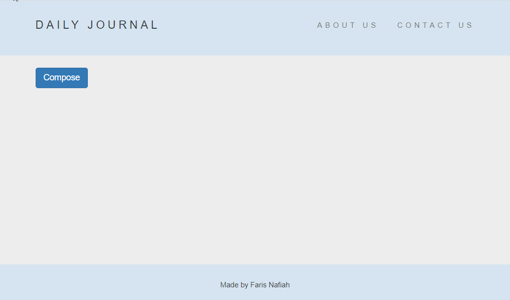

# Blog web app

This is intended for self-practise with Node+Express and MongoDB. The main aim is to be able to build Express server, with MongoDB incorporated.

## Previews


## Requirements
* Node.js
* Express.js
* MongoDB
* EJS

## Installation
#### Initiating MongoDB server
This needs to be done in a different tab in the CLI.
```
$ mongod
```
Mongoose is connected to `mongodb://localhost:27017/blogDB3`, where blogDB3 is the database.
#### Cloning from Github
(In a different CLI tab)
```
$ git clone https://github.com/farisnafiah/me_n-blog.git
$ cd me_n-blog
```
#### Installing NPM modules
```
$ npm install
```
#### Starting Node app
```
$ nodemon app.js
```

## Features
* Compose a new blog entry.
* Edits existing blog entry.
* Deletes blog entry.
* Navigates the blog entry page.
